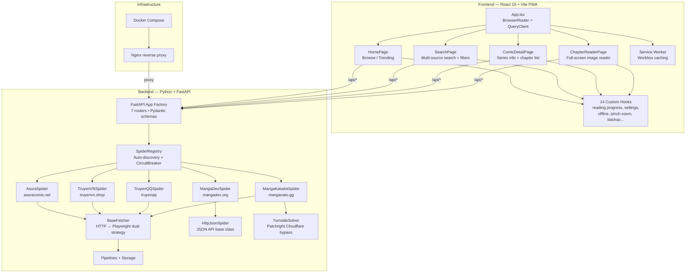
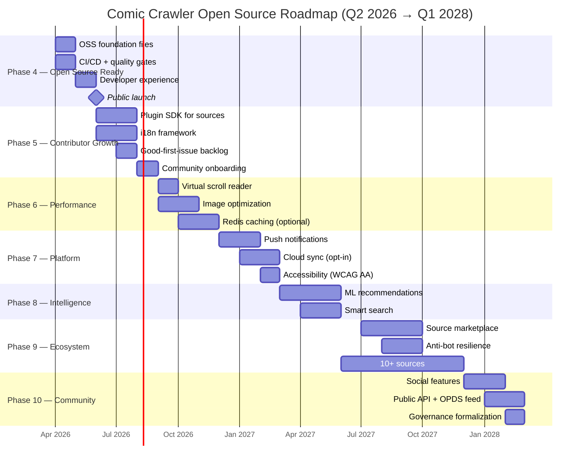
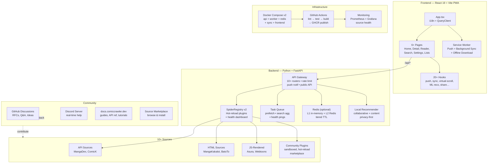

# Comic Crawler — 2-Year Open Source Roadmap (2026–2028)

> **Philosophy:** Community-first, contributor-friendly, develop in public. Every decision should make it easier for someone new to understand, contribute to, and extend this project.

---

## Architecture Overview (Current)

---

## Open Source Principles

These principles guide every phase of this roadmap:

| Principle | What it means in practice |
|-----------|--------------------------|
| **🔓 Open by default** | All development happens on GitHub — issues, PRs, discussions, roadmap |
| **📖 Docs-first** | Every feature ships with docs. No undocumented API, no tribal knowledge |
| **🤝 Contributor-friendly** | Low barrier to entry: `good-first-issue` labels, dev containers, one-command setup |
| **🏛️ Transparent governance** | Public decision-making via RFCs. Clear path from contributor → maintainer |
| **🧩 Modular design** | Plugin SDK for sources so anyone can contribute without touching core |
| **🌍 Global reach** | i18n from day one. Accept translations as first-class contributions |
| **🔒 Security-conscious** | SECURITY.md, responsible disclosure, dependency scanning |
| **♿ Accessible** | WCAG AA. Reading comics should be for everyone |

---

## Current State (March 2026)

### ✅ Completed (Phases 1–3)
| Area | What's done |
|------|-------------|
| **Backend hardening** | Rate limiting (slowapi), CORS lockdown, structured errors, trace IDs, LRU singleton caching, HTTP cache headers |
| **Frontend quality** | ErrorBoundary, 14 shared hooks, 30+ CSS design tokens, lazy-loaded routes |
| **User features** | Favorites, reading history, read/unread markers, reader preferences (localStorage) |
| **Reader** | Webtoon/paged modes, pinch-zoom, double-tap zoom, next-chapter prefetch |
| **Discovery** | Multi-source search (dedicated SearchPage), filters, genre-based recommendations, recently updated |
| **Offline/PWA** | Download chapters, cache management, JSON export/import backup, 5-strategy Workbox caching |
| **Spiders** | Auto-discovery registry, HttpJsonSpider base, circuit breaker, per-source rate limits |
| **5 sources** | Asura, TruyenVN, TruyenQQ, MangaDex, MangaKakalot (manganato.gg) |
| **Anti-bot** | Patchright-based Turnstile solver, `curl_cffi` for Cloudflare bypass, `nodriver` headless evasion |
| **API** | 7 routers (sources, search, comics, trending, categories, recommendations, image-proxy), Pydantic schemas |
| **Architecture** | Monorepo (`backend/` + `frontend/`), 4 lazy-loaded pages, 33 components |
| **Testing** | 238 tests, 13 files, ruff clean, mypy strict |
| **Docker** | Production Docker Compose with health checks, Nginx proxy, multi-stage builds, pip cache mounts |

---

## 2-Year Timeline

---

## Phase 4 — Open Source Ready (Q2 2026) 🔴 P0

> **Goal:** Ship everything needed so a stranger on GitHub can clone, understand, contribute, and self-host in under 15 minutes.

### 4.1 Foundation Files ✅

| File | Purpose | Status |
|------|---------|--------|
| `LICENSE` | MIT | ✅ Done |
| `CODE_OF_CONDUCT.md` | Contributor Covenant v2.1 | ✅ Done |
| `CONTRIBUTING.md` | How to report bugs, suggest features, submit PRs, write a spider | ✅ Done |
| `SECURITY.md` | Responsible disclosure process, supported versions | ✅ Done |
| `.github/ISSUE_TEMPLATE/` | Bug report, feature request, new source request templates | ✅ Done |
| `.github/PULL_REQUEST_TEMPLATE.md` | PR checklist: tests pass, docs updated, screenshots if UI | ✅ Done |
| `.github/FUNDING.yml` | GitHub Sponsors / Ko-fi / Open Collective links | ✅ Done |
| `CHANGELOG.md` | Keep-a-Changelog format, auto-generated from conventional commits | ✅ Done |

### 4.2 CI/CD Pipeline

- [ ] **GitHub Actions — CI** (on every PR):
  - `ruff check` + `ruff format --check`
  - `mypy --strict`
  - `pytest` with coverage report (target ≥ 80%)
  - Frontend: `tsc --noEmit` + `eslint`
  - Lighthouse CI audit (performance ≥ 90)
- [ ] **GitHub Actions — CD** (on `main` merge):
  - Build + push Docker images to GitHub Container Registry (GHCR)
  - Auto-tag releases from conventional commits
  - Publish changelog to GitHub Releases
- [ ] **Pre-commit hooks** (`.pre-commit-config.yaml`):
  - `ruff`, `mypy`, `prettier`, commit message lint (conventional commits)
- [ ] **Dependabot / Renovate** for automated dependency updates

### 4.3 Developer Experience

- [x] **One-command setup**: `make dev` → spins up backend + frontend + hot-reload
- [ ] **Dev Container** (`.devcontainer/`): VS Code + Codespaces ready, all deps pre-installed
- [x] **Makefile** with standard targets: `dev`, `test`, `lint`, `build`, `docker-up`
- [x] **Enhanced README**:
  - Architecture diagram
  - "Contributing your first spider" quick-start (link to CONTRIBUTING.md)
  - Shields.io badges: CI status, coverage, license, Python/Node versions
  - GIF demo of the reader in action
- [ ] **ADR directory** (`docs/adr/`): Architecture Decision Records for major choices
- [x] **Existing source template** (`docs/source-template.md`) — already written, link prominently

### 4.4 Public Launch Checklist

- [ ] Transfer repo to GitHub (or make public if already there)
- [ ] Write launch announcement (blog post / Reddit / HN / dev.to)
- [ ] Set up GitHub Discussions (categories: Q&A, Ideas, Show & Tell)
- [ ] Create `v1.0.0` release with changelog
- [ ] Social media handles reserved

---

## Phase 5 — Contributor Growth (Q2–Q3 2026) 🟠 P1

> **Goal:** Make it so easy to add a source that community members do it themselves.

### 5.1 Source Plugin SDK

- [ ] **Spider protocol v2**: versioned interface with JSON schema validation
- [ ] **CLI generator**: `comic-crawler create-source <name>` → scaffold with tests
- [ ] **Hot-reload**: drop a spider module in `plugins/` → auto-registered, no restart
- [ ] **Sandboxed execution**: process isolation for untrusted community plugins
- [ ] **Plugin testing harness**: `pytest` fixture that validates any spider against the protocol
- [ ] **Tutorial**: "Write your first source in 30 minutes" with video walkthrough

### 5.2 Internationalization

- [ ] `react-i18next` with namespace-based translation files
- [ ] Extract all hard-coded strings → `locales/en.json`
- [ ] Add Vietnamese (`vi.json`) as second language
- [ ] **Translation contribution guide**: how to add a language (no coding needed!)
- [ ] Crowdin or Weblate integration for community translations
- [ ] Auto-detect language from `navigator.language`

### 5.3 Good-First-Issue Backlog

- [ ] Triage existing issues with labels: `good-first-issue`, `help-wanted`, `docs`, `spider`
- [ ] Create 15+ starter issues across categories:
  - 🐛 Bug fixes (well-scoped, with reproduction steps)
  - 📖 Documentation improvements
  - 🌐 Translation additions
  - 🕷️ New source implementations
  - 🎨 UI/UX refinements
- [ ] Each issue includes: context, expected behavior, files to change, difficulty rating

### 5.4 Community Onboarding

- [ ] **Discord server** with channels: `#general`, `#help`, `#dev`, `#sources`, `#showcase`
- [ ] **Monthly community call** (recorded, notes posted to Discussions)
- [ ] **Contributor spotlight**: highlight contributors in release notes
- [ ] **Hacktoberfest-ready**: participating label, contribution guide
- [ ] **Mentorship pairing**: experienced contributors help first-timers on labeled issues

---

## Phase 6 — Performance (Q3–Q4 2026) 🟡 P2

> **Goal:** Handle 200+ page chapters smoothly. All PRs welcome.

### 6.1 Virtual Scroll Reader

- [ ] `react-window` or `react-virtuoso` for long-strip mode
- [ ] Render visible images ± 3 buffer only
- [ ] Scroll position restoration across chapter navigation
- [ ] Target: <16ms frame time with 200+ pages

### 6.2 Image Optimization

- [ ] Backend proxy with on-the-fly WebP/AVIF conversion
- [ ] Responsive sizing: 720p mobile, full-res desktop
- [ ] Progressive JPEG / blurhash placeholders
- [ ] CDN-friendly cache headers

### 6.3 Redis Caching Layer (Optional)

- [ ] Replace in-memory `cachetools` with Redis for multi-instance deployments
- [ ] Tiered TTLs: browse (5min), detail (10min), chapters (30min)
- [ ] Keep `cachetools` as fallback for single-instance / development
- [ ] Document both paths in deployment guide

### 6.4 Observability

- [ ] Prometheus `/metrics` endpoint (latency histograms, error rates, circuit breaker state)
- [ ] Structured JSON logging to stdout
- [ ] Grafana dashboard template (shipped in `monitoring/` directory)
- [ ] Example Docker Compose with Prometheus + Grafana for self-hosters

---

## Phase 7 — Platform Features (Q4 2026 – Q1 2027) 🟢 P3

> **Goal:** PWA feature parity with native apps.

### 7.1 Push Notifications

- [ ] Web Push API + VAPID keys for new chapter alerts
- [ ] Per-series subscription toggles
- [ ] iOS Web Push support (home screen install required)
- [ ] Notification grouping + quiet hours

### 7.2 Cloud Sync (Opt-In)

- [ ] Lightweight sync server (FastAPI + SQLite) — self-hostable
- [ ] Sync: favorites, reading progress, preferences
- [ ] E2E encryption option
- [ ] Graceful fallback to localStorage-only
- [ ] Published as separate container: `comic-crawler-sync`

### 7.3 Accessibility (WCAG AA)

- [ ] axe-core audit + manual screen reader testing
- [ ] Keyboard navigation: arrow keys, space, escape in reader
- [ ] High-contrast mode toggle
- [ ] `aria-label` and `role` across all interactive elements
- [ ] Focus management on page transitions
- [ ] Document a11y testing in CONTRIBUTING.md so contributors can validate

---

## Phase 8 — Intelligence & Discovery (Q1–Q2 2027) 🔵 P4

> **Goal:** Smarter, privacy-respecting discovery — all running locally.

### 8.1 Smart Recommendations

- [ ] Collaborative filtering: "readers who liked X also liked Y" (local-first)
- [ ] Content-based similarity using genre + tag embeddings
- [ ] Hybrid scoring: collaborative + content + popularity
- [ ] Personalized homepage feed
- [ ] "Surprise me" random discovery with quality floor
- [ ] **All computation runs locally** — no tracking, no analytics, no data leaves the device

### 8.2 Smart Search

- [ ] Fuzzy/typo-tolerant search (Levenshtein / trigram)
- [ ] Search by description, author, artist
- [ ] "Did you mean?" suggestions
- [ ] Search ranking by relevance + user preference signals

---

## Phase 9 — Ecosystem (Q2–Q4 2027) 🟣 P5

> **Goal:** 10+ sources, community-maintained, resilient to anti-bot.

### 9.1 Source Marketplace

- [ ] Browseable index of community sources at `sources.comiccrawler.dev`
- [ ] One-click install from marketplace → hot-reload into running instance
- [ ] Source quality badges: tests passing, response time, uptime %
- [ ] Review workflow: community PR → automated test → maintainer merge

### 9.2 Anti-Bot Resilience

- [ ] Managed browser pool: rotate Playwright contexts with random fingerprints
- [ ] TLS fingerprint rotation via `curl_cffi` impersonation profiles
- [ ] Cascading fetch: HTTP → stealth HTTP → full browser → managed proxy
- [ ] Turnstile/CAPTCHA detection + automatic retry
- [ ] Per-source proxy pool configuration
- [ ] Document anti-bot strategies in wiki for source authors

### 9.3 New Sources (target: 10+)

- [ ] **ComicK** (JSON API)
- [ ] **Webtoons.com** (browser-based)
- [ ] **BatoTo** (HTTP)
- [ ] **ReadComicOnline** (Playwright)
- [ ] Community-contributed sources with CI validation
- [ ] Each new source is a `good-first-issue` candidate with the scaffold generator

### 9.4 Source Health Dashboard

- [ ] Public status page: UP/DOWN/DEGRADED per source
- [ ] Response time percentiles (p50/p95/p99)
- [ ] Automatic failover suggestions
- [ ] Historical availability tracking

---

## Phase 10 — Community & Sustainability (Q4 2027 – Q1 2028) 💜

> **Goal:** Sustainable project with clear governance and a thriving community.

### 10.1 Social Features

- [ ] Public reading lists: curated collections shareable via link
- [ ] Series ratings + short reviews (localStorage or sync server)
- [ ] Reading streaks + local achievement badges
- [ ] Privacy-first: all social features opt-in, no tracking

### 10.2 Public API & Interoperability

- [ ] Public REST API with API key auth
- [ ] OPDS feed for compatibility with Kavita, Komga, Panels, etc.
- [ ] OpenAPI spec published + interactive docs
- [ ] Embeddable reader widget (web component)

### 10.3 Governance Formalization

- [ ] Published governance model: Benevolent Dictator → Core Team → Contributors
- [ ] Clear path: **Contributor** (1+ merged PR) → **Trusted Contributor** (5+ PRs) → **Core Team** (sustained contribution + nomination)
- [ ] **RFC process** for breaking changes or major features
- [ ] Annual roadmap vote: community prioritizes next year's features
- [ ] **Sustainability model**: GitHub Sponsors + Open Collective, transparent finances

---

## Architecture Vision (2028)

---

## Open Source Launch Readiness Checklist

> Complete all items before making the repo public.

### Repository
- [x] `LICENSE` file (MIT) present and headers in all source files
- [x] `README.md` with badges, architecture diagram, quick-start, demo GIF
- [x] `CONTRIBUTING.md` — bug reports, PRs, source contributions, translations
- [x] `CODE_OF_CONDUCT.md` — Contributor Covenant v2.1
- [x] `SECURITY.md` — responsible disclosure, supported versions
- [x] `CHANGELOG.md` — Keep-a-Changelog format
- [x] `.github/ISSUE_TEMPLATE/` — bug, feature, new source templates
- [x] `.github/PULL_REQUEST_TEMPLATE.md`
- [x] `.github/FUNDING.yml`

### Developer Experience
- [x] `make dev` one-command setup works on macOS + Linux
- [ ] `.devcontainer/` for VS Code / Codespaces
- [x] All tests pass: `pytest`, `tsc`, `eslint`
- [ ] CI pipeline green on `main`
- [x] Docker `docker compose up` → working app in <2 minutes

### Documentation
- [x] API docs at `/docs` (FastAPI auto-generated)
- [x] Source contribution tutorial (`docs/source-template.md`)
- [ ] Architecture Decision Records (`docs/adr/`)
- [ ] Self-hosting deployment guide

### Community
- [ ] GitHub Discussions enabled
- [ ] Discord server created with appropriate channels
- [ ] 15+ issues labeled `good-first-issue`
- [ ] Social media handles reserved

---

## Priority Matrix

| Priority | Phase | Timeline | Key Deliverable |
|----------|-------|----------|-----------------|
| 🔴 **P0** | Phase 4 — OSS Ready | Q2 2026 | Foundation files + CI/CD + public launch |
| 🟠 **P1** | Phase 5 — Growth | Q2–Q3 2026 | Plugin SDK + i18n + community onboarding |
| 🟡 **P2** | Phase 6 — Performance | Q3–Q4 2026 | Virtual scroll + image optimization |
| 🟢 **P3** | Phase 7 — Platform | Q4 2026–Q1 2027 | Push notifications + cloud sync + a11y |
| 🔵 **P4** | Phase 8 — Intelligence | Q1–Q2 2027 | Local-first ML recommendations |
| 🟣 **P5** | Phase 9 — Ecosystem | Q2–Q4 2027 | Source marketplace + 10 sources |
| 💜 **P6** | Phase 10 — Community | Q4 2027+ | Governance + sustainability + public API |

---

## Contribution Areas for the Community

> Designed so anyone can contribute meaningfully, regardless of experience level.

| Level | Contribution Type | Skills needed |
|-------|-------------------|--------------|
| 🟢 **Beginner** | Translations, typo fixes, docs improvements | Any language |
| 🟢 **Beginner** | Bug reports with reproduction steps | Using the app |
| 🟡 **Intermediate** | New source implementation (using scaffold) | Python basics |
| 🟡 **Intermediate** | UI component improvements | React + CSS |
| 🟡 **Intermediate** | Test coverage improvements | pytest / vitest |
| 🔴 **Advanced** | Core spider framework changes | Python async |
| 🔴 **Advanced** | PWA features (push, sync, offline) | Service workers |
| 🔴 **Advanced** | Anti-bot / scraping resilience | Browser automation |

---

## Industry Context

| Trend | Our response |
|-------|-------------|
| **Anti-bot arms race** (Cloudflare Turnstile, TLS fingerprinting) | Multi-layer fetch cascade, community-documented strategies |
| **Tachiyomi/Mihon ecosystem** (extension-based plugins) | Phase 5 SDK, inspired by their plugin model but web-first |
| **PWA feature parity** (push, background sync, file handling) | Phase 7 systematic adoption |
| **Self-hosted readers** (Komga, Kavita) | OPDS feed for interoperability in Phase 10 |
| **AI recommendations** (collaborative filtering) | Phase 8, privacy-first, all computation local |
| **Open source sustainability** | GitHub Sponsors + Open Collective + transparent governance |

---

> **Next step:** Complete Phase 4 (OSS Ready) → public launch → Phase 5 (grow contributors).  
> **Mantra:** _Make it easy to contribute. Make it impossible to break._
